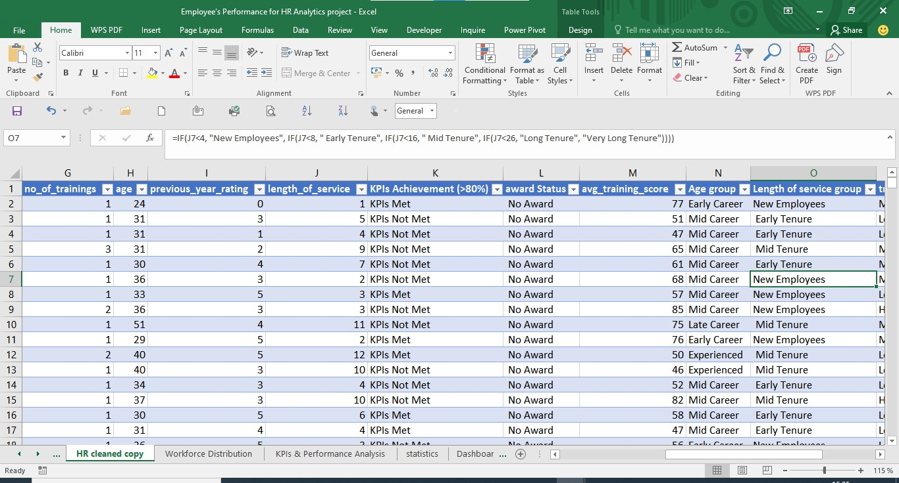
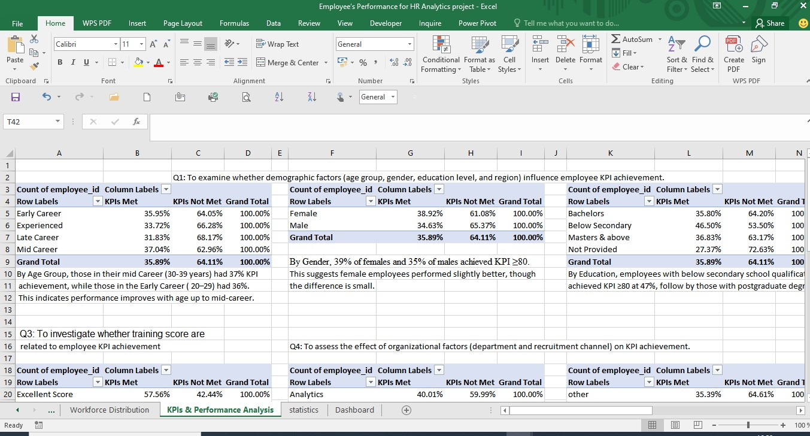
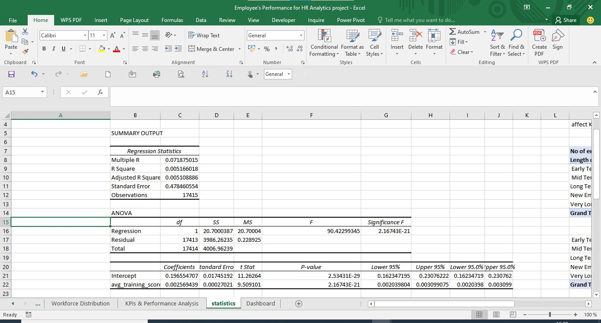
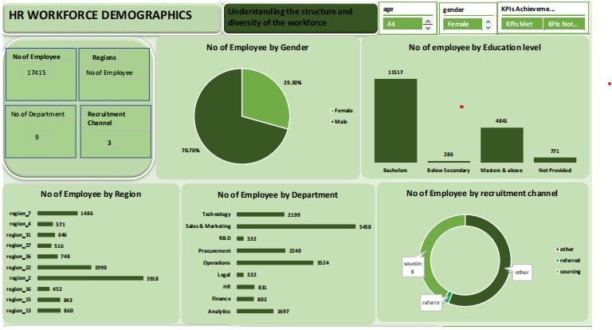

# -HR-Analytics-Project

# 📊 Project Overview

This project analyzes an HR dataset of 17,415 employees to understand workforce demographics and the factors influencing KPI achievement.
The analysis was performed in Microsoft Excel, using Pivot Tables, Charts, and built-in Statistical tools (Chi-Square, Regression).
The goal is to generate insights that support data-driven HR decisions on recruitment, training, and performance management.

# 🛠️ Process
### 1. Data Preparation

- Imported dataset into Excel.

- Cleaned missing and inconsistent entries.

- ##### Created grouped columns for:

Age Groups (20–60)

Length of Service Groups (1–34 years)

Training Score Groups (Low–High)

Converted binary values (e.g., 0/1) into meaningful labels such as Award Status and KPI Status.

### 2. Descriptive Analysis (Excel Pivot Tables)

*Workforce Demographics* → Gender, Age, Education, Department, Region, Recruitment Channel.

*KPI Achievement* → Cross-tabulated with training score, awards, service length, education, and demographics.

# 3. Statistical Testing

### Chi-Square Test to assess categorical relationships:

Awards vs KPI Achievement → Significant (p < 0.001)

Recruitment Channel vs KPI Achievement → Significant (p < 0.001)

Length of Service vs KPI Achievement → Not significant

### Regression Analysis (Training Score vs KPI Achievement):

Training score is a significant predictor, but with weak explanatory power (R² = 0.005).

# 🔑 Key Findings
---- 

- Workforce is male-dominated (70.7%) and concentrated in Sales & Marketing and Operations.

- Awards & Recognition significantly improve KPI achievement.

- Recruitment Channel strongly affects the quality of hires.

- Training Scores predict KPI achievement but explain only a small portion of performance.

- Length of Service has no statistically significant effect on KPI achievement.

# ✅ Recommendations

- Strengthen Recognition Programs → More frequent awards tied to KPI performance.

- Enhance Training Programs → Focus on early-career and bachelor’s-level employees.

- Refine Recruitment Strategy → Invest more in high-performing channels.

- Promote Gender Diversity → Attract and retain more female employees.

- Continuous Monitoring → Use dashboards & regular statistical reviews to track progress.

# 📌 Conclusion
.jpeg)

This analysis highlights that awards, recruitment channels, and training quality are the most significant drivers of KPI performance, while length of service has limited impact.
The insights recommend HR to focus on recognition, training, and recruitment strategies, while also addressing gender imbalance to build a more inclusive and high-performing workforce.
